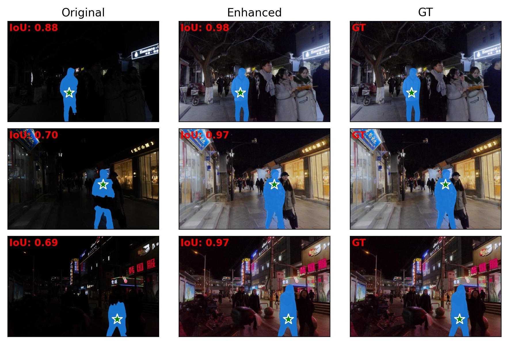
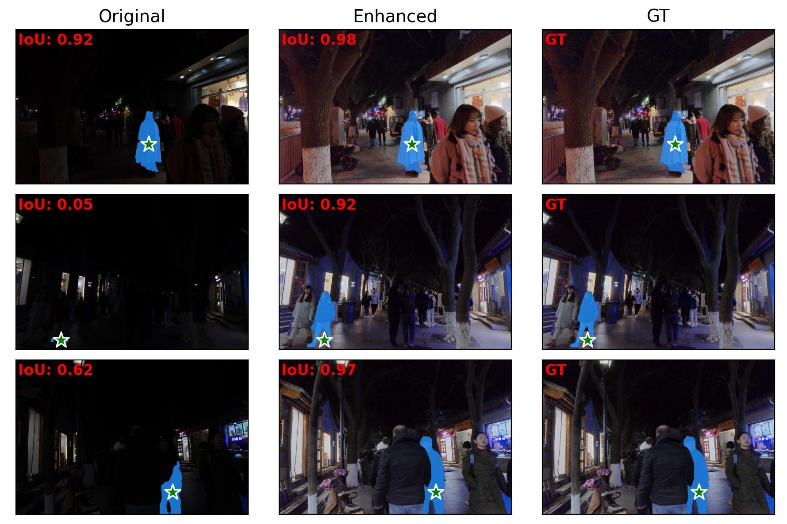
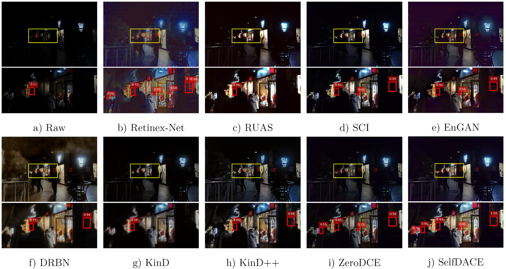
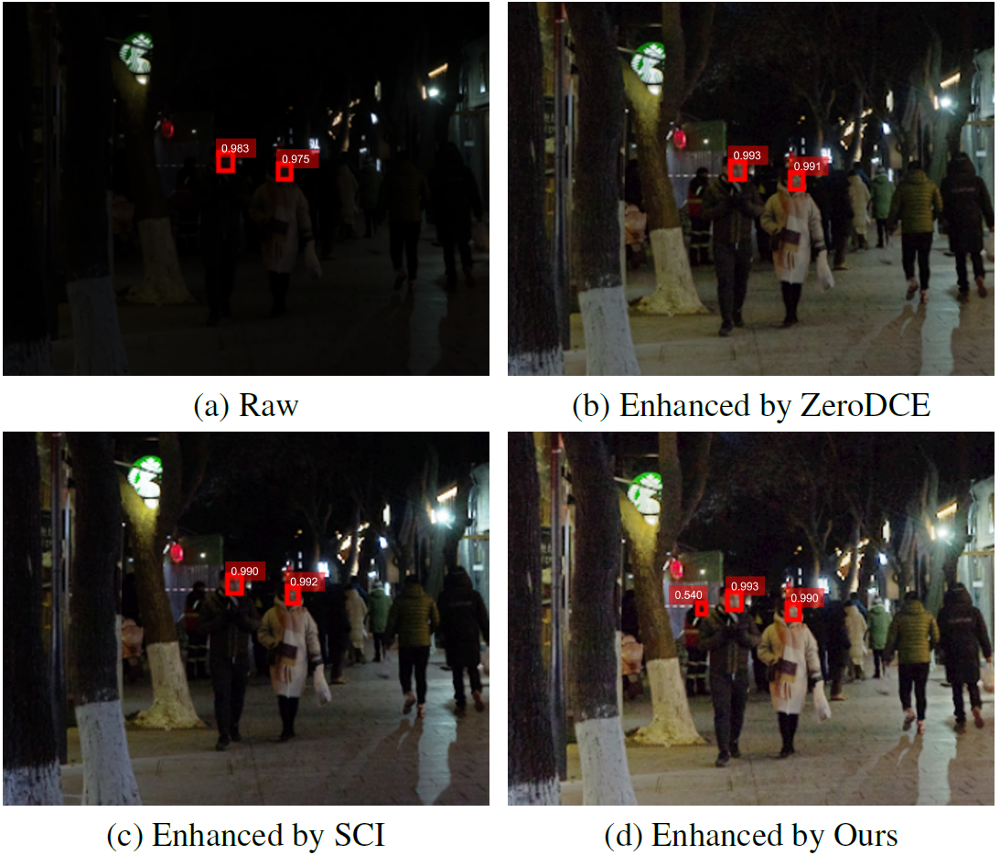

# Self-DACE LLIE Method
Official pytorch version for Self-Reference Deep Adaptive Curve Estimation for Low-Light Image Enhancement

- Paper is avalible at [arXiv version - Self-Reference Deep Adaptive Curve Estimation for Low-Light Image Enhancement](https://arxiv.org/pdf/2308.08197.pdf)

# Demo
## Demo on Low-light Images
 |  
---|---
 |  

Visual comparison with original low-light image
on [LOL](https://daooshee.github.io/BMVC2018website/) and [SCIE](https://github.com/csjcai/SICE) dataset. The enhanced images of our
method are on the top-right corners, and the input low-light
images are on the bottom-left corners.

## Demo on Improvement of Low-light Image Interactive Segmentation


Demostration of improvement for segmentation task on [DarkFace Dataset](https://www.kaggle.com/datasets/soumikrakshit/dark-face-dataset) using [PiClick](https://github.com/cilinyan/PiClick).
The green stars are the objects of interactive segmentation what we want to segment.
GT is annotated on the enhanced images manually by us.

## Demo on Improvement of Low-light Face detection


Demostration of improvement for Dark Face Detection task ([CVPR UG2+ Challenge 2021](http://cvpr2022.ug2challenge.org/program21/track1.html)) on [DarkFace Dataset](https://www.kaggle.com/datasets/soumikrakshit/dark-face-dataset) using [DSFD](https://github.com/Tencent/FaceDetection-DSFD).
The red box is the where the DSFD identifies the human face, and a larger red box means it has a lower confidence score. The yellow box zooms in the region which contains human faces. The number on the top of red box is the confidence score given by DSFD with a confidence threshold of 0.5.

# Quantitative Comparison
## Table 1. Quantitative comparisons in terms of four full-reference image quality metrics including PSNR(dB), SSIM, LPIPS and CIEDE2000 on the LOL test, LSRWand SCIE Part2 datasets.
 

Ours* is the result only from Stage-I.

### Note:
- Our metric values are in line with [Low-Light Image and Video Enhancement Using Deep Learning: A Survey](https://github.com/Li-Chongyi/Lighting-the-Darkness-in-the-Deep-Learning-Era-Open).

## Table 2. Comparisons of computational complexity in termsof number of trainable parameters and FLOPs.

<div align=center>

</div>

Ours∗ is the model of Stage-I, and Ours is the model including Stage-I and Stage-II. Those are applied to a 3x1200×900 image.

## Visual Comparison on LIME
<div align=center>

</div>

The blue box zooms in the complex light and dark junction of the input image.
Image of Ours∗ is the output only from Stage-I.

# How to use it
## Prerequisite
```
cd ./codes_SelfDACE
pip install -r ./requirements.txt
```

## Test Stage-I (only enhancing luminance)
```
cd ./stage1
python test_1stage.py
```
Test dates should be placed in `codes_SelfDACE/stage1/data/test_data/low_eval`,
And then results would be found in `codes_SelfDACE/stage1/data/result/low_eval`.

## Test both Stage-I and Stage-II (enhancing luminance and denoising)
```
cd ./stage2
python test_1stage.py
```
Test dates should be placed in `codes_SelfDACE/stage2/data/test_data/low_eval`,
And then results would be found in `codes_SelfDACE/stage2/data/result/low_eval`.

# How to train it
## Prerequisite
```
cd ./codes_SelfDACE
pip install -r ./requirements.txt
```

## Train Stage-I (only enhancing luminance)
1.
      You should download the training dataset from [SCIE_part1](https://github.com/csjcai/SICE) and resize all images to 512x512.
      Or you could download it directly from [SCIE_part1_ZeroDCE_version](https://github.com/Developer-Zer0/ZeroDCE), of which iamges have been cropped to 512x512 already. If you want to use it in your work, please cite [SCIE_part1](https://github.com/csjcai/SICE).

2.
      ```
      cd ./stage1
      python train_1stage.py
      ```

## Train Stage-II (only denoising)

1.
      Copy the `pre-trained model` and `training dataset` from stage1, and put `pre-trained model` of Stage-I in `./stage2/snapshots_light`

2.
      ```
      cd ./stage2
      python train_2stage.py
      ```
# Acknowledgment
This paper gets a big inspiration from [ZeroDCE](https://github.com/Li-Chongyi/Zero-DCE).

# Citation
If you find our work useful for your research, please cite our paper
```
@article{wen2023self,
  title={Self-Reference Deep Adaptive Curve Estimation for Low-Light Image Enhancement},
  author={Wen, Jianyu and Wu, Chenhao and Zhang, Tong and Yu, Yixuan and Swierczynski, Piotr},
  journal={arXiv preprint arXiv:2308.08197},
  year={2023}
}
```
# Hope AI would light our unknown and unforeseeable routes to the future as well as human's as ligting the low-light image
- Thanks for all related work and workers.
