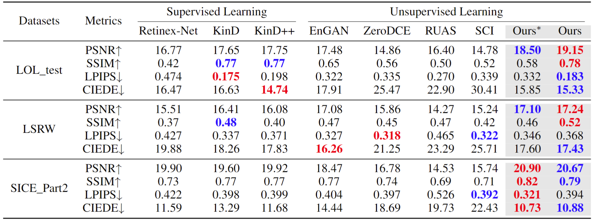

# Self-DACE LLIE method
Official pytorch version for Self-Reference Deep Adaptive Curve Estimation for Low-Light Image Enhancement

Paper is avalible at [arXiv version - Self-Reference Deep Adaptive Curve Estimation for Low-Light Image Enhancement](https://arxiv.org/pdf/2308.08197.pdf)

(There are some typos in formulas and figures, which will be rectified at 22 Aug 2023 00:00)

# Demo
 |  
---|---
 |  

Visual comparison with original low-light image
on LOL and SCIE dataset. The enhanced images of our
method are on the top-right corners, and the input low-light
images are on the bottom-left corners.

# Comparison
## Table 1. Quantitative comparisons in terms of four full-reference image quality metrics including PSNR(dB), SSIM, LPIPS and CIEDE2000 on the LOL test, LSRWand SCIE Part2 datasets.
 

Ours* is the result only from Stage-I.

P.S. We use `PSNR` and `SSIM` functions from `tenosrflow`, and the two metrics from different toolboxs could be significant different.
For example, if you use `peak_signal_noise_rati` from `skimage.metrics`, you will find psnr is higher than ours. 
This is because in `skimage.metrics`, `psnr = np.log10((data_range ** 2) / err)`, where `data_range = dmax - dmin`, and `err` is a scale factor `err = mean_squared_error(image_true, image_test)`,
and if you use `psnr` in `tensorflow`, the calculation is 
```
    mse = math_ops.reduce_mean(math_ops.squared_difference(a, b), [-3, -2, -1])
    psnr_val = math_ops.subtract(
        20 * math_ops.log(max_val) / math_ops.log(10.0),
        np.float32(10 / np.log(10)) * math_ops.log(mse),
        name='psnr')
```
without a foctor to amplify it.

Thereofore, the metric values are different from other papers', but ours are in line with [Low-Light Image and Video Enhancement Using Deep Learning: A Survey](https://github.com/Li-Chongyi/Lighting-the-Darkness-in-the-Deep-Learning-Era-Open).

## Table 2. Comparisons of computational complexity in termsof number of trainable parameters and FLOPs.
 

Ours∗ is the model of Stage-I, and Ours is the model including Stage-I and Stage-II.

P.S. those are applied to a 3x1200×900 image.

## Visual Comparison on LIME


The blue box zooms in the complex light and dark junction of the input image.
Image of Ours∗ is the output only from Stage-I.

# How to use it
## Prerequisite
```
cd ./codes_SelfDACE
pip install -r ./requirements.txt
```

## Test Stage-I (only enhancing luminance)
```
cd ./stage1
python test_1stage.py
```
test dates should be placed in `codes_SelfDACE/stage1/data/test_data/low_eval`,
and then results would be found in `codes_SelfDACE/stage1/data/result/low_eval`.

## Test both Stage-I and Stage-II (enhancing luminance and denoising)
```
cd ./stage2
python test_1stage.py
```
test dates should be placed in `codes_SelfDACE/stage2/data/test_data/low_eval`,
and then results would be found in `codes_SelfDACE/stage2/data/result/low_eval`.

## Train Stage-I (only enhancing luminance)
1. you should download the training dataset from [SCIE_part1](https://github.com/csjcai/SICE) and resize all images to 512x512.
   Or you could download it directly from [SCIE_part1_ZeroDCE_version](https://github.com/Developer-Zer0/ZeroDCE).

   If you want to use it in your work, please cite [SCIE_part1](https://github.com/csjcai/SICE).

3.
```
cd ./stage1
python train_1stage.py
```

## Train Stage-II

1. Copy the `pre-trained model` and `training dataset` from stage1, and put `pre-trained model` of Stage-I in `./stage2/snapshots_light`

2. 
```
cd ./stage2
python train_2stage.py
```

# Citation
If you find our work useful for your research, please cite our paper
```
@misc{wen2023selfreference,
      title={Self-Reference Deep Adaptive Curve Estimation for Low-Light Image Enhancement}, 
      author={Jianyu Wen and Chenhao Wu and Tong Zhang and Yixuan Yu and Piotr Swierczynski},
      year={2023},
      eprint={2308.08197},
      archivePrefix={arXiv},
      primaryClass={eess.IV}
}
```
# Hope AI would light our unknow and hazy future as well as human's like ligting the low-light image
Thanks for all related work and workers.
